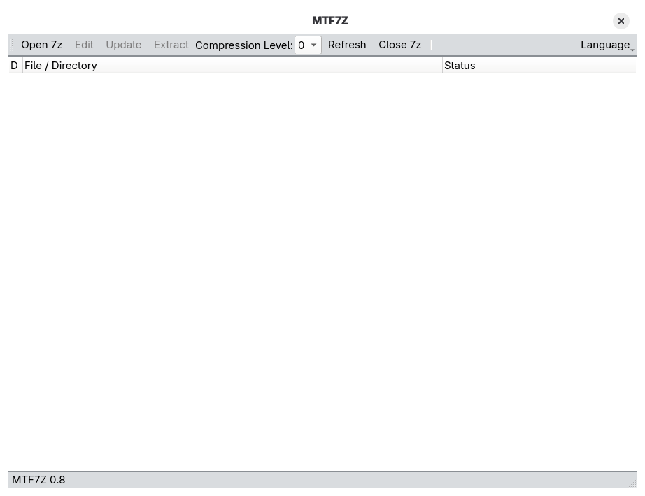
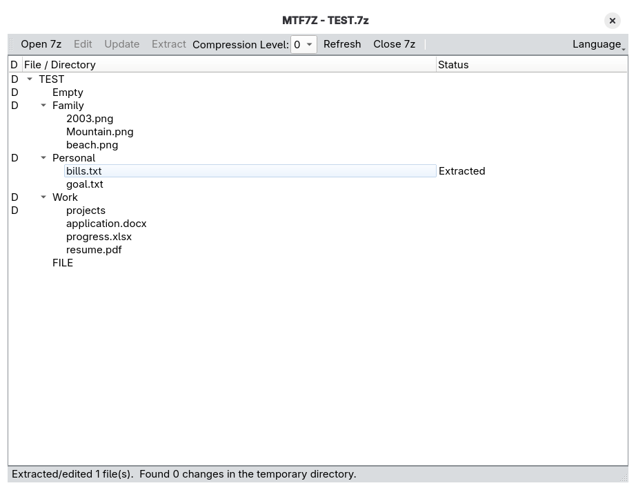
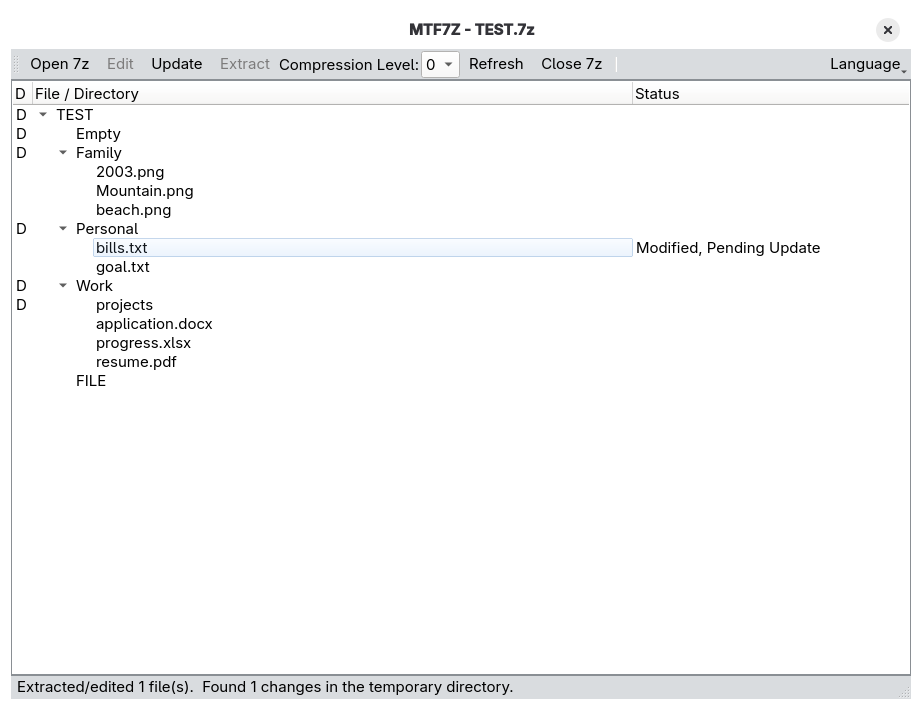
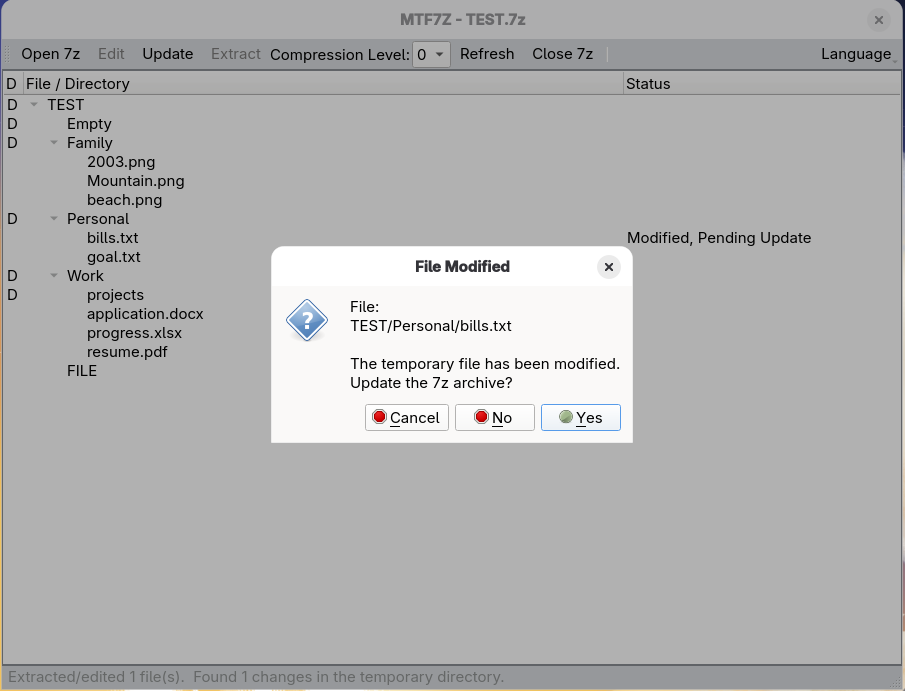

# MTF7Z

A lightweight tool for Managing Text Files inside 7z archives.

MTF7Z is designed for working with text files stored in `.7z` archives without manually extracting and repacking files. Selected files can be extracted to a temporary working directory, opened with an external application, and updated back into the archive after editing.

## Screenshots









## Features

- Browse the contents of `.7z` archives
- Display files and directories in a tree view
- Select multiple files at once
- Extract selected files to a temporary working directory
- Open text/image files using the system's default application
- Update modified files back into the original archive
- Add new files and directories to an archive
- Delete archive entries when corresponding files are removed
- Configurable compression level for added or updated files
- Multi-language user interface

## Requirements

### Supported Platforms

- Linux

### Dependencies

- Python 3.10 or later
- PySide6
- 7-Zip

MTF7Z uses the 7-Zip command-line tools to perform archive operations.

Make sure that `7z` or `7zz` is available in your system `PATH`, or configure the application to use the appropriate 7-Zip executable.

## Installation

Before running the program, make sure **7-Zip** and **Python (>= 3.10)** are installed.

* [7-Zip](https://www.7-zip.org/)
* [Python](https://www.python.org/)


Install the Python dependencies:

```bash
pip install "PySide6>=6.11.2"
```

Download the repository to a local directory, such as `MTF7Z`, then run the application:

```bash
cd MTF7Z
python main.py
```

## Usage

### Open an archive

Open a `.7z` archive from the application.

The archive contents are displayed in a tree view, allowing files and directories to be browsed.

### Extract files

Select one or more files and choose **Extract**.

The selected files are extracted to the application's temporary working directory without automatically opening them.

### Edit files

Select one or more supported text or image files and choose **Edit**.

The files are first extracted to the temporary working directory and then opened using the system's default application.

Files that are not recognized as text or image files are extracted and opened in the file manager instead.

### Update the archive

After editing or modifying files in the temporary working directory, click **Refresh** to detect changes, then select **Update** to apply them to the archive.


MTF7Z checks the working directory for:

- Modified files
- Deleted files
- Newly created files
- Newly created directories

The application asks for confirmation before making changes to the archive.

Modified files replace their corresponding entries in the archive.

New files and directories can be added to the archive.

Deleted files can be removed from the archive.

Directories in the archive are not deleted automatically.

### Temporary working directory

When a 7z archive is opened, a temporary directory is created in the same directory as the archive to store files extracted later.

The temporary directory is removed after the archive is closed and the user confirms that any pending changes have been handled.

## Configuration

The configuration file is located at:

`~/.config/MTF7Z/MTF7Z_config.conf`

The file is created automatically when the program is first run.

## Compression

When adding or updating files, the compression level can be configured.

A compression level of `0` can be used when storing files without additional compression.

When a compression level other than `0` is selected, solid compression is disabled for the updated files.

## File Types

MTF7Z uses the Linux `file` command to identify common text file formats.

Image files are also recognized and can be opened with the system's default application.

Other file types can still be extracted, but they are not automatically opened by MTF7Z.

## Localization

MTF7Z supports multiple interface languages.

Translation files are stored in the `translations` directory.

Currently available languages include:

- Deutsch
- English
- Español
- Français
- Русский
- 日本語
- 简体中文
- 繁體中文

## Miscellaneous

This project was developed with the assistance of large language models (LLMs). The code was generated by LLMs, and the multilingual translations were also created with the help of LLMs.

MTF7Z uses the `xdg-open` and `file` utilities, so it currently supports Linux only. It has been tested on Fedora 43 with the GNOME desktop environment.

Direct extraction of directories is currently not supported.

## Acknowledgements

Thanks to the developers and contributors of:

- 7-Zip
- Python
- PySide6 / Qt

## License

MTF7Z is licensed under the MIT License.
